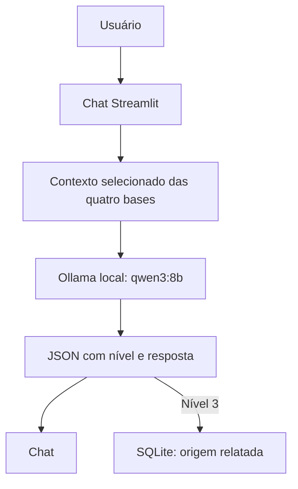

# Documentação do Agente — VestiGuard

## Caso de Uso

### Problema

Uma pessoa pode ter dúvidas sobre investimentos e receber ofertas por redes sociais, links ou terceiros sem saber quais dados conferir antes de tomar uma decisão. Uma explicação genérica pode deixar de perceber pedidos de Pix para conta pessoal ou de token.

### Solução

O VestiGuard explica conceitos de investimentos e interpreta o relato do usuário em quatro níveis: 0 (fora do tema), 1 (educação), 2 (informação que precisa ser verificada) e 3 (pausar um envio ou buscar o banco, se já transferiu). Para o nível 3, orienta procurar atendimento humano em canal oficial. O agente não valida uma oferta ou uma instituição em tempo real.

### Público-Alvo

Pessoas que querem entender investimentos ou conversar sobre uma oferta recebida. Neste exercício, os dados de perfil, produtos, transações e atendimentos representam um cliente fictício; o aplicativo não faz autenticação de clientes reais.

---

## Persona e Tom de Voz

### Nome do Agente

VestiGuard.

### Personalidade

Acolhedor, didático, direto e atento aos relatos de ofertas. Aborda segurança sem acusar pessoas ou causar alarme.

### Tom de Comunicação

Português do Brasil, linguagem simples e respostas breves. Faz uma pergunta curta quando falta informação relevante.

### Exemplos de Linguagem

- Saudação sugerida: "Olá! Posso ajudar a entender um investimento ou conversar sobre uma oferta que você recebeu."
- Confirmação: "Preciso verificar essa oferta. Qual instituição aparece nela?"
- Limitação: "Não identifiquei esse produto na base. Você pode explicar melhor?"
- Segurança após transferência: "Entre em contato com seu banco imediatamente pelo aplicativo ou outro canal oficial e procure atendimento humano para relatar o Pix."

---

## Arquitetura

### Diagrama

### Componentes

| Componente | Descrição |
|------------|-----------|
| Interface | Chat Streamlit local com histórico da sessão e indicação do nível. |
| LLM | `qwen3:8b` via endpoint local `http://localhost:11434/api/chat`; classifica e redige a resposta. |
| Base de conhecimento | Quatro arquivos JSON/CSV fictícios na pasta `data` do fork, baixados pelo aplicativo do GitHub. |
| Seleção de contexto | `montar_contexto()` inclui nomes e até três produtos relacionados; perfil e até três linhas de transações/atendimentos entram conforme o assunto. |
| Histórico | Até quatro mensagens anteriores da sessão entram na chamada ao modelo. |
| Registro de alertas | SQLite local guarda data, nível 3 e origem detectada, sem salvar a conversa inteira. |
| Tratamento de falhas | A interface distingue erro HTTP, conexão e timeout do Ollama; não há verificação automática de fatos externos. |

---

## Segurança e Anti-Alucinação

### Estratégias Adotadas

- [x] Instrução para não confirmar ofertas, rentabilidades, garantias ou corretoras que a base não confirma.
- [x] Separação entre tipo de investimento e oferta específica.
- [x] Encaminhamento para canal oficial e atendimento humano em relatos de nível 3.
- [x] Orientação diferente quando o Pix já foi enviado: contatar o banco imediatamente.
- [x] Não pedir saldo, renda, patrimônio, senha, token, códigos ou dados bancários completos.
- [x] Bases e falas do usuário tratadas como dados, não como instruções.
- [ ] Checagem externa e automática de instituições e ofertas: não implementada.
- [ ] Validação programática independente do nível retornado pela LLM: não implementada.

### Limitações Declaradas

O VestiGuard não recomenda compras, não promete retorno, não consulta cotações atuais, não confere em tempo real o registro de instituições, não autentica a identidade do usuário e não substitui atendimento humano. Classificação e resposta dependem do modelo; os testes realizados não garantem acerto em toda mensagem. O banco SQLite é apenas um registro local para análise posterior; não envia relatos a um atendente.
